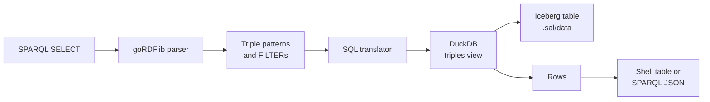

SAL answers SPARQL by **translating it to SQL**, not by loading the graph into a triplestore.
A `SELECT` query is parsed, rewritten into a DuckDB statement over the `triples` view of the built Iceberg table, and executed there.

This keeps queries running directly against the data product on disk or in object storage, with no separate database to load or keep in sync.
The cost is that only the subset of SPARQL that has a direct relational translation is supported; everything else is reported as an error rather than silently answered wrong.
[Supported syntax](#supported-syntax) is the exact list.

## Where you can run a query

| Surface | Notes |
| --- | --- |
| [`sal query --sparql`](/sal/reference/commands/#sal-query) | Interactive shell. `Ctrl` + `R` runs, `F2` shows the translated SQL, `Ctrl` + `H` lists the other keys, `Ctrl` + `D` quits. |
| [`sal serve`](/sal/reference/commands/#sal-serve) | SPARQL Protocol endpoint at `/sparql`, answering `application/sparql-results+json`. |
| `sal serve --with-ui` | The **SPARQL** tab, a [YASGUI](https://github.com/zazuko/Yasgui) editor pointed at that same local endpoint. |

All three go through the same translator, so a query that works in one works in all of them.
The shell caps a query that declares no `LIMIT` at 100 rows so an exploratory query cannot print the whole table; the HTTP endpoint applies no implicit limit.

## How it works



1. **Parse.** The query text is parsed by `goRDFlib`'s SPARQL parser. A query that is not a `SELECT`, or that uses a solution modifier the translator cannot express, is rejected here.
2. **Flatten the pattern.** The `WHERE` clause is walked and reduced to a flat list of triple patterns plus a list of `FILTER` expressions. A group pattern that is neither, such as `OPTIONAL` or `UNION`, ends the walk with an error.
3. **Translate.** Each triple pattern becomes one self-join of the `triples` view; constants become `WHERE` equalities and shared variables become join conditions. This is described in [The translation](#the-translation) below.
4. **Execute.** DuckDB runs the statement against the Iceberg table through the `triples` view, reading the current snapshot. DuckDB is linked into the `sal` binary, so no external database or `duckdb` CLI is involved.
5. **Render.** Every column is rendered to text by DuckDB itself, then printed as a table by the shell or encoded as SPARQL JSON by the endpoint.

The DuckDB handle, its extensions, and the `triples` view are opened once per process and reused, so `sal serve` pays that cost on the first request rather than on every one.

### The translation

Every triple pattern becomes one aliased scan of the `triples` view, joined to the others:

- A **constant** in subject, predicate, or object position becomes an equality against that alias's column.
- The **first occurrence of a variable** binds to that alias and column.
- A **repeated variable** becomes a join condition equating its first binding with the new position, which is what makes a multi-pattern query a join rather than a cross product.
- The **projection** selects each variable's bound column under its own name. `SELECT *` projects every variable in the order it was first seen.

So this query:

```sparql
PREFIX schema: <https://schema.org/>

SELECT ?s ?age
WHERE {
  ?s schema:name "bob" .
  ?s schema:age ?age .
}
```

becomes:

```sql
SELECT t0.subject AS "s", t1.object AS "age"
FROM triples AS t0
CROSS JOIN triples AS t1
WHERE t0.predicate = 'https://schema.org/name'
  AND t0.object = 'bob'
  AND t0.subject = t1.subject
  AND t1.predicate = 'https://schema.org/age'
```

The `CROSS JOIN` is not a cartesian product in practice: the shared `?s` contributes `t0.subject = t1.subject` to the `WHERE` clause, which DuckDB plans as an inner join.

Press `F2` in `sal query --sparql` to see the SQL generated for whatever is in the editor.

### Object columns

Which column an object binds to depends on how the table was built.

A table built **without** `--typed` has a single `object` column, and every object term — IRI or literal — is compared and projected as text.

A table built with [`sal build --typed`](/sal/reference/commands/#sal-build) splits objects across `object_iri`, `object_float`, `object_string`, and `object_geometry`. The translator picks the column from the term it is being compared against:

| Term in the query | Column used |
| --- | --- |
| An IRI or prefixed name | `object_iri` |
| A number, or a literal whose lexical form parses as one | `object_float` |
| Any other literal | `object_string` |

A projected object variable is read back as `COALESCE(object_iri, CAST(object_float AS VARCHAR), object_string, ST_AsText(object_geometry))`, so a result row shows the object whichever column holds it. A triple whose object is a GeoSPARQL WKT literal stores its geometry in `object_geometry` and leaves the other object columns null; projecting it renders the geometry back to WKT, such as `POINT (-89.5 40.5)`. The `ST_AsText` is what makes projecting an object load DuckDB's spatial extension the first time; a join or a comparison on an object variable never renders the geometry and so never needs it.

In a `FILTER`, the same rule applies to whichever side the variable is compared against, so `FILTER(?age > 21)` compares `object_float` while `FILTER(?name = "bob")` compares `object_string`. A variable passed to a [GeoSPARQL function](#geosparql) is read as `object_geometry` itself.

## Supported syntax

### Query forms

| Keyword | Supported | Notes |
| --- | --- | --- |
| `SELECT` | Yes | The only supported query form. |
| `SELECT *` | Yes | Projects every variable bound by a triple pattern. |
| `DISTINCT` | Yes | Becomes `SELECT DISTINCT`. |
| `PREFIX` | Yes | Prefixed names are expanded before translation; an undeclared prefix is an error. |
| `WHERE` | Yes | Must contain at least one triple pattern. |
| `FILTER` | Partly | Comparisons and boolean combinations only — see [Filters](#filters). |
| `LIMIT` | Yes | Becomes `LIMIT`. |
| `ASK`, `CONSTRUCT`, `DESCRIBE` | No | `only read-only SPARQL SELECT queries are supported`. |
| `OFFSET`, `ORDER BY`, `GROUP BY`, `HAVING` | No | `SPARQL projection expressions and solution modifiers are not supported yet`. |
| Aggregates and projection expressions, e.g. `(COUNT(?s) AS ?n)` | No | Same error. Count in SQL instead: `SELECT count(*) FROM triples`. |
| `OPTIONAL`, `UNION`, `MINUS`, `GRAPH`, `BIND`, `VALUES`, subqueries | No | `only basic SPARQL triple patterns and FILTER expressions are supported yet`. |
| Property paths, e.g. `schema:knows/schema:name` | No | `SPARQL property paths are not supported yet`. |
| `REDUCED` | Ignored | Accepted, but results are not deduplicated. Use `DISTINCT` if you need that. |

Everything the engine supports is read-only. There is no SPARQL Update surface at all; the way to change a data product is to edit its RDF source files and run `sal build` again.

### Triple patterns

| Construct | Supported | Notes |
| --- | --- | --- |
| Variables, `?s` or `$s` | Yes | Both sigils work, in any of the three positions. |
| Full IRIs, `<https://example.org/a>` | Yes | Used verbatim. |
| Prefixed names, `schema:name` | Yes | Expanded from the query's `PREFIX` declarations. |
| The `a` keyword | Yes | Expands to `rdf:type`. |
| Predicate-object lists, `?s p1 ?a ; p2 ?b` | Yes | Expanded by the parser into separate patterns. |
| Plain and typed literals | Yes | Compared by lexical form; see the note below. |
| Language-tagged literals, `"hello"@en` | Partly | The tag is dropped and only `"hello"` is matched. |
| Blank nodes, `_:b` | No | Reported as an unknown prefix `_`. |
| `BASE` and relative IRIs | No | `BASE` parses but is not applied; a relative IRI is matched literally, not resolved. |

A datatype is used only to decide which object column to compare against, never matched itself. `"5"^^xsd:integer`, `"5"^^xsd:double`, and a bare `5` all become the same comparison, because the table stores every number as a `DOUBLE`. A literal whose lexical form is not numeric, such as `"2026-06-02"^^xsd:date`, is compared as a string.

### Filters

`FILTER` supports comparisons between a variable and a constant, or between two constants, combined with `&&` and `||`:

| Operator | Supported | Notes |
| --- | --- | --- |
| `=`, `!=`, `<`, `>`, `<=`, `>=` | Yes | |
| `&&`, `\|\|`, `!` | Yes | |
| GeoSPARQL `geof:` functions | Partly | See [GeoSPARQL](#geosparql). |
| Arithmetic, `IN`, `EXISTS` | No | |
| Functions such as `REGEX`, `STR`, `LANG`, `BOUND` | No | |

Several `FILTER`s in one group are all applied, as if joined by `&&`.
A `FILTER` over a variable no triple pattern binds is an error rather than a query that matches nothing.

```sparql
PREFIX schema: <https://schema.org/>

SELECT ?s
WHERE {
  ?s schema:age ?age .
  FILTER(?age >= 21 && ?age < 65)
}
```

```sql
SELECT t0.subject AS "s"
FROM triples AS t0
WHERE t0.predicate = 'https://schema.org/age'
  AND (t0.object_float >= 21 AND t0.object_float < 65)
```

### GeoSPARQL

A `FILTER` may call the [GeoSPARQL](https://www.ogc.org/standards/geosparql/) functions that have a direct analog in DuckDB's spatial extension. Each becomes the `ST_` function it names; there is no geometry logic in SAL itself.

| GeoSPARQL function | DuckDB | Notes |
| --- | --- | --- |
| `geof:sfEquals`, `geof:sfDisjoint`, `geof:sfIntersects`, `geof:sfTouches`, `geof:sfCrosses`, `geof:sfWithin`, `geof:sfContains`, `geof:sfOverlaps` | `ST_Equals`, `ST_Disjoint`, `ST_Intersects`, `ST_Touches`, `ST_Crosses`, `ST_Within`, `ST_Contains`, `ST_Overlaps` | Boolean; use directly in the `FILTER`, optionally negated or combined with `&&` and `\|\|`. |
| `geof:distance(a, b)` or `geof:distance(a, b, uom:degree)` | `ST_Distance` | In the degrees the coordinates are stored in. Compare the result against a number. |
| `geof:distance(a, b, uom:metre)` | `ST_Distance_Sphere` | Great-circle metres, which DuckDB computes between points only. |
| `geof:envelope`, `geof:boundary`, `geof:convexHull` | `ST_Envelope`, `ST_Boundary`, `ST_ConvexHull` | Geometry-valued; nest inside one of the functions above. |
| `geof:intersection`, `geof:union`, `geof:difference`, `geof:symDifference` | `ST_Intersection`, `ST_Union`, `ST_Difference`, `ST_SymDifference` | Same. |
| `geof:buffer`, `geof:getSRID`, the Egenhofer `geof:eh*` and RCC8 `geof:rcc8*` relations | — | `GeoSPARQL function geof:... is not supported yet`. |

A geometry argument is one of:

- a **variable bound in object position**, read as `object_geometry` on a table built with `--typed`, or parsed from the text object with `ST_GeomFromText` on one built without it;
- a **`geo:wktLiteral`**, which becomes `ST_GeomFromText('...')`. A leading CRS IRI such as `<http://www.opengis.net/def/crs/OGC/1.3/CRS84>` is dropped, since the stored geometries carry none;
- a nested **geometry-valued `geof:` call** from the table above.

A variable bound as a subject or predicate, a `geo:gmlLiteral`, or a function that yields a boolean where a geometry is expected is an error.

```sparql
PREFIX schema: <https://schema.org/>
PREFIX geo: <http://www.opengis.net/ont/geosparql#>
PREFIX geof: <http://www.opengis.net/def/function/geosparql/>

SELECT ?place ?name ?wkt
WHERE {
  ?place schema:name ?name .
  ?place geo:hasGeometry ?geometry .
  ?geometry geo:asWKT ?wkt .
  FILTER(geof:sfIntersects(?wkt, "POLYGON((-91 39, -88 39, -88 42, -91 42, -91 39))"^^geo:wktLiteral))
}
```

```sql
SELECT t0.subject AS "place",
  COALESCE(t0.object_iri, CAST(t0.object_float AS VARCHAR), t0.object_string, ST_AsText(t0.object_geometry)) AS "name",
  COALESCE(t2.object_iri, CAST(t2.object_float AS VARCHAR), t2.object_string, ST_AsText(t2.object_geometry)) AS "wkt"
FROM triples AS t0
CROSS JOIN triples AS t1
CROSS JOIN triples AS t2
WHERE t0.predicate = 'https://schema.org/name'
  AND t0.subject = t1.subject
  AND t1.predicate = 'http://www.opengis.net/ont/geosparql#hasGeometry'
  AND COALESCE(t1.object_iri, CAST(t1.object_float AS VARCHAR), t1.object_string) = t2.subject
  AND t2.predicate = 'http://www.opengis.net/ont/geosparql#asWKT'
  AND ST_Intersects(t2.object_geometry, ST_GeomFromText('POLYGON((-91 39, -88 39, -88 42, -91 42, -91 39))'))
```

The `?wkt` column of the result is the stored geometry rendered back to WKT, so the **Map** tab of `sal serve --with-ui` can draw it; see [`--with-ui`](/sal/reference/commands/#--with-ui).

## Examples

Every distinct predicate in the data product:

```sparql
SELECT DISTINCT ?p
WHERE {
  ?s ?p ?o .
}
LIMIT 25
```

Everything a resource states:

```sparql
SELECT ?p ?o
WHERE {
  <https://example.org/alice> ?p ?o .
}
```

Instances of a class, with a property of each:

```sparql
PREFIX schema: <https://schema.org/>

SELECT ?s ?name
WHERE {
  ?s a schema:Person .
  ?s schema:name ?name .
}
```

Which version of each vocabulary the build validated against, from the provenance `sal build` writes into the table:

```sparql
PREFIX rdf: <http://www.w3.org/1999/02/22-rdf-syntax-ns#>
PREFIX owl: <http://www.w3.org/2002/07/owl#>
PREFIX dcterms: <http://purl.org/dc/terms/>

SELECT ?ontology ?versionIRI ?format ?modified
WHERE {
  ?ontology rdf:type owl:Ontology .
  ?ontology owl:versionIRI ?versionIRI .
  ?ontology dcterms:format ?format .
  ?ontology dcterms:modified ?modified .
}
```

See [Pinned vocabularies](/sal/reference/data-layout/#querying-pinned-vocabularies) for what those triples mean.

## The HTTP endpoint

`sal serve` implements the SPARQL Protocol query operation at `/sparql`:

- `GET /sparql?query=...`
- `POST /sparql` with `Content-Type: application/sparql-query` and the query as the body
- `POST /sparql` with `Content-Type: application/x-www-form-urlencoded` and a `query` field

The response is `application/sparql-results+json`. A request whose `Accept` header asks for anything other than that, `application/json`, or a wildcard is answered `406`; a query the translator rejects is answered `400` with the error message as the body. CORS is open, so a browser client on another origin can query it.

```sh
curl -s 'http://localhost:8080/sparql' \
  -H 'Accept: application/sparql-results+json' \
  --data-urlencode 'query=SELECT ?s ?p ?o WHERE { ?s ?p ?o . } LIMIT 1'
```

```json
{
  "head": { "vars": ["s", "p", "o"] },
  "results": {
    "bindings": [
      {
        "s": { "type": "uri", "value": "https://example.org/alice" },
        "p": { "type": "uri", "value": "https://schema.org/name" },
        "o": { "type": "literal", "value": "Alice" }
      }
    ]
  }
}
```

Because results come back from SQL as text, a binding's `type` is inferred from its value rather than carried from the table: a value starting with `http://` or `https://` is reported as a `uri`, one starting with `_:` as a `bnode`, and everything else as a `literal`. Language tags are not reported, and the only datatype that is is `geo:wktLiteral`, on a literal that reads as WKT — the one datatype a value gives away on its own.

## When the subset is not enough

Two ways around it, depending on what you need:

- **Query the table as SQL.** [`sal query`](/sal/reference/commands/#sal-query) opens the same `triples` view in a DuckDB shell, and `sal serve --with-ui` exposes `POST /api/sql`. Aggregation, ordering, window functions, the full set of `ST_` geometry functions, and joins against imported data products are all available there. A project that imported a data product with `sal import oci://...` gets a view per imported table plus an `imports` view stacking them, none of which SPARQL can reach — SPARQL only ever queries the project's own `triples` view.
- **Take the graph elsewhere.** [`sal export`](/sal/reference/commands/#sal-export) writes the data product as N-Triples, which any full SPARQL engine can load.
