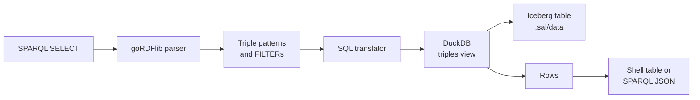

SAL answers SPARQL by **translating it to SQL**, not by loading the graph into a triplestore.
A `SELECT` query is parsed, rewritten into a DuckDB statement over the `triples` view of the built Iceberg table, and executed there.

This keeps queries running directly against the data product on disk or in object storage, with no separate database to load or keep in sync.
The cost is that only the subset of SPARQL that has a direct relational translation is supported; everything else is reported as an error rather than silently answered wrong.
[Supported syntax](#supported-syntax) is the exact list.

## Where you can run a query

| Surface | Notes |
| --- | --- |
| [`sal query --sparql`](/sal/reference/commands/#sal-query) | Interactive shell. `Ctrl` + `R` runs, `F2` shows the translated SQL, `Ctrl` + `H` lists the other keys, `Ctrl` + `D` quits. |
| [`sal serve`](/sal/reference/commands/#sal-serve) | SPARQL Protocol endpoint at `/sparql`, answering `application/sparql-results+json`. `/v{snapshot}/sparql` is the same endpoint over the table at an earlier Iceberg snapshot. |
| `sal serve --with-ui` | The **SPARQL** tab, a [YASGUI](https://github.com/zazuko/Yasgui) editor pointed at that same local endpoint. |

All three go through the same translator, so a query that works in one works in all of them.
The shell caps a query that declares no `LIMIT` at 100 rows so an exploratory query cannot print the whole table; the HTTP endpoint applies no implicit limit.

## How it works



1. **Parse.** The query text is parsed by `goRDFlib`'s SPARQL parser. A query that is not a `SELECT`, or that uses a solution modifier the translator cannot express, is rejected here.
2. **Flatten the pattern.** The `WHERE` clause is walked and reduced to a flat list of triple patterns, a list of `FILTER` expressions, and the groups a `MINUS` subtracts. A pattern written with a property path is replaced by the patterns it reduces to; see [Property paths](#property-paths). A pattern inside a `SERVICE` clause is kept with the endpoint it was written under. A group pattern that is none of these, such as `OPTIONAL` or `UNION`, ends the walk with an error.
3. **Translate.** Each triple pattern becomes one self-join of the `triples` view; constants become `WHERE` equalities and shared variables become join conditions. This is described in [The translation](#the-translation) below.
4. **Execute.** DuckDB runs the statement against the Iceberg table through the `triples` view, reading the current snapshot. The view holds the statements the project itself makes; the ones its pinned vocabularies make are in the table too, marked in the `vocabulary` column, and only a pattern over an RDFS schema predicate in a query that asks for reasoning reads them, see [Reasoning over pinned vocabularies](#reasoning-over-pinned-vocabularies). A query sent to `sal serve`'s `/v{snapshot}/sparql` route scans the table at that snapshot instead: each triple pattern becomes an `iceberg_scan(..., snapshot_from_id = {snapshot})` in place of the view, filtered the same way, so the translated SQL says which snapshot it reads. DuckDB is linked into the `sal` binary, so no external database or `duckdb` CLI is involved.
5. **Render.** Every column is rendered to text by DuckDB itself, then printed as a table by the shell or encoded as SPARQL JSON by the endpoint.

The DuckDB handle, its extensions, and the `triples` view are opened once per process and reused, so `sal serve` pays that cost on the first request rather than on every one.

### The translation

Every triple pattern becomes one aliased scan of the `triples` view, joined to the others:

- A **constant** in subject, predicate, or object position becomes an equality against that alias's column.
- The **first occurrence of a variable** binds to that alias and column.
- A **repeated variable** becomes a join condition equating its first binding with the new position, which is what makes a multi-pattern query a join rather than a cross product.
- The **projection** selects each variable's bound column under its own name. `SELECT *` projects every variable in the order it was first seen.

So this query:

```sparql
PREFIX schema: <https://schema.org/>

SELECT ?s ?age
WHERE {
  ?s schema:name "bob" .
  ?s schema:age ?age .
}
```

becomes:

```sql
SELECT t0.subject AS "s", t1.object AS "age"
FROM triples AS t0
CROSS JOIN triples AS t1
WHERE t0.predicate = 'https://schema.org/name'
  AND t0.object = 'bob'
  AND t0.subject = t1.subject
  AND t1.predicate = 'https://schema.org/age'
```

The `CROSS JOIN` is not a cartesian product in practice: the shared `?s` contributes `t0.subject = t1.subject` to the `WHERE` clause, which DuckDB plans as an inner join.

Press `F2` in `sal query --sparql` to see the SQL generated for whatever is in the editor.

### Object columns

The table splits objects across `object_iri`, `object_string`, `object_geometry`, `object_byte`, `object_integer`, `object_float`, and `object_time` (see [Data Layout](/sal/reference/data-layout/#rdf-triples)), and the translator picks the column from the term an object is being compared against:

| Term in the query | Column used |
| --- | --- |
| An IRI or prefixed name | `object_iri` |
| A bare number, or a literal typed with a numeric XSD datatype | `COALESCE` over `object_float`, `object_integer`, and `object_byte` |
| An `xsd:dateTime` literal with an explicit timezone | `object_time`, compared as a `TIMESTAMP` normalized to UTC |
| Any other literal | `object_string` |
| A geometry, in a [GeoSPARQL function](#geosparql) | `object_geometry` |

A projected object variable is read back as a `COALESCE` over every object column rendered as text — `object_iri`, the numeric columns cast to `VARCHAR`, `object_time` rendered back to its ISO form, `object_string`, and `ST_AsText(object_geometry)` — so a result row shows the object whichever column holds it. A triple whose object is a GeoSPARQL WKT literal stores its geometry in `object_geometry` and leaves the other object columns null; projecting it renders the geometry back to WKT, such as `POINT (-89.5 40.5)`. The `ST_AsText` is what makes projecting an object load DuckDB's spatial extension the first time; a join or a comparison on an object variable never renders the geometry and so never needs it.

In a `FILTER`, the same rule applies to whichever side the variable is compared against, so `FILTER(?age > 21)` compares the numeric columns while `FILTER(?name = "bob")` compares `object_string`. Note that a quoted number like `"42"` is an `xsd:string` and compares against `object_string`, matching where build stores it.

## Supported syntax

### Query forms

| Keyword | Supported | Notes |
| --- | --- | --- |
| `SELECT` | Yes | The only supported query form. |
| `SELECT *` | Yes | Projects every variable bound by a triple pattern. |
| `DISTINCT` | Yes | Becomes `SELECT DISTINCT`. |
| `PREFIX` | Yes | Prefixed names are expanded before translation; an undeclared prefix is an error. |
| `WHERE` | Yes | Must contain at least one triple pattern. |
| `FILTER` | Partly | Comparisons and boolean combinations only — see [Filters](#filters). |
| `LIMIT` | Yes | Becomes `LIMIT`. |
| `ASK`, `CONSTRUCT`, `DESCRIBE` | No | `only read-only SPARQL SELECT queries are supported`. |
| `(LANG(?o) AS ?lang)`, `(DATATYPE(?o) AS ?type)` | Yes | The only projection expressions; see [Language tags and datatypes](#language-tags-and-datatypes). |
| `OFFSET`, `ORDER BY`, `GROUP BY`, `HAVING` | No | `SPARQL solution modifiers are not supported yet`. |
| Aggregates and other projection expressions, e.g. `(COUNT(?s) AS ?n)` | No | `SPARQL function "count" is not supported yet`. Count in SQL instead: `SELECT count(*) FROM triples`. |
| `SERVICE <endpoint> { ... }` | Partly | Only this server's own `/sparql` and `/v{snapshot}/sparql` endpoints; see [Diffing snapshots with SERVICE and MINUS](#diffing-snapshots-with-service-and-minus). |
| `MINUS { ... }` | Yes | Becomes a correlated `NOT EXISTS` subquery; see [MINUS and EXISTS](#minus-and-exists). |
| `FILTER EXISTS { ... }`, `FILTER NOT EXISTS { ... }` | Yes | Become a correlated `EXISTS` / `NOT EXISTS` subquery, usable inside `&&`, `\|\|`, and `!`. |
| `OPTIONAL`, `UNION`, `GRAPH`, `BIND`, `VALUES`, subqueries | No | `only basic SPARQL triple patterns and FILTER expressions are supported yet`. |
| Property paths, e.g. `rdf:type/rdfs:subClassOf*` | Partly | Sequences, inverses, alternatives, negated sets, and repetition of a single step; see [Property paths](#property-paths). |
| `REDUCED` | Ignored | Accepted, but results are not deduplicated. Use `DISTINCT` if you need that. |

Everything the engine supports is read-only. There is no SPARQL Update surface at all; the way to change a data product is to edit its RDF source files and run `sal build` again.

### Triple patterns

| Construct | Supported | Notes |
| --- | --- | --- |
| Variables, `?s` or `$s` | Yes | Both sigils work, in any of the three positions. |
| Full IRIs, `<https://example.org/a>` | Yes | Used verbatim. |
| Prefixed names, `schema:name` | Yes | Expanded from the query's `PREFIX` declarations. |
| The `a` keyword | Yes | Expands to `rdf:type`. |
| Predicate-object lists, `?s p1 ?a ; p2 ?b` | Yes | Expanded by the parser into separate patterns. |
| Plain and typed literals | Yes | Compared by lexical form; see the note below. |
| Language-tagged literals, `"hello"@en` | Yes | Matched by value and tag, against `object_string` and `object_language`. |
| Blank nodes, `_:b` | No | Reported as an unknown prefix `_`. |
| `BASE` and relative IRIs | No | `BASE` parses but is not applied; a relative IRI is matched literally, not resolved. |

A datatype is used only to decide which object column to compare against, never matched itself. `"5"^^xsd:integer`, `"5"^^xsd:double`, and a bare `5` all become the same comparison, a `COALESCE` over the numeric columns cast to `DOUBLE`, so a value matches however it was typed. An `xsd:dateTime` with an explicit timezone compares against `object_time` as a `TIMESTAMP`. A literal stored as a string — an `xsd:string` (quoted `"42"` included), a zoneless dateTime, or a datatype without a typed column such as `"2026-06-02"^^xsd:date` — is compared as a string.

### Filters

`FILTER` supports comparisons between a variable and a constant, or between two constants, combined with `&&` and `||`:

| Operator | Supported | Notes |
| --- | --- | --- |
| `=`, `!=`, `<`, `>`, `<=`, `>=` | Yes | |
| `&&`, `\|\|`, `!` | Yes | |
| `LANG`, `DATATYPE`, `LANGMATCHES` | Yes | Over an object variable; see [Language tags and datatypes](#language-tags-and-datatypes). |
| GeoSPARQL `geof:` functions | Partly | The Simple Features relations, `geof:distance`, and the geometry constructors; see [GeoSPARQL](#geosparql). |
| Arithmetic, `IN`, `EXISTS` | No | |
| Functions such as `REGEX`, `STR`, `BOUND` | No | |

Several `FILTER`s in one group are all applied, as if joined by `&&`.
A `FILTER` over a variable no triple pattern binds is an error rather than a query that matches nothing.

```sparql
PREFIX schema: <https://schema.org/>

SELECT ?s
WHERE {
  ?s schema:age ?age .
  FILTER(?age >= 21 && ?age < 65)
}
```

```sql
SELECT t0.subject AS "s"
FROM triples AS t0
WHERE t0.predicate = 'https://schema.org/age'
  AND (COALESCE(t0.object_float, CAST(t0.object_integer AS DOUBLE), CAST(t0.object_byte AS DOUBLE)) >= 21
   AND COALESCE(t0.object_float, CAST(t0.object_integer AS DOUBLE), CAST(t0.object_byte AS DOUBLE)) < 65)
```

## MINUS and EXISTS

`MINUS { ... }`, `FILTER EXISTS { ... }`, and `FILTER NOT EXISTS { ... }` each become an `EXISTS` subquery in the `WHERE` clause, correlated to the enclosing query through the variables the two share.
The group inside is translated like a query of its own, one aliased scan per triple pattern (`x0_0`, `x0_1`, ..., a second group gets `x1_`), and every variable it shares with the enclosing query becomes a correlation clause instead of a new binding:

| Shared variable | Correlation |
| --- | --- |
| Subject or predicate | `x0_0.subject = t0.subject` |
| Object | The rendered text, language tag, and datatype compared with `IS NOT DISTINCT FROM`, so two literals are the same solution only when they are the same RDF term, and a geometry compares by its WKT. |
| A whole pattern, `?s ?p ?o` against `?s ?p ?o` of one enclosing scan | `x0_0.triple_hash = t0.triple_hash`, which asks whether that exact triple exists in one comparison and never renders an object. |

```sparql
PREFIX schema: <https://schema.org/>

SELECT ?station
WHERE {
  ?station schema:name ?name .
  MINUS { ?station schema:identifier ?id . }
}
```

```sql
SELECT t0.subject AS "station"
FROM triples AS t0
WHERE t0.predicate = 'https://schema.org/name'
  AND NOT EXISTS (SELECT 1
  FROM triples AS x0_0
  WHERE x0_0.predicate = 'https://schema.org/identifier'
    AND x0_0.subject = t0.subject)
```

The two follow SPARQL's own scoping rules, which differ:

- `MINUS` subtracts through the variables of the group *before* it only. `{ A MINUS { B } C }` subtracts `B` from `A`; a variable `B` shares with `C` alone is not a correlation. A `MINUS` group sharing no variable with the group before it subtracts nothing, and a `FILTER` inside it may name only the group's own variables.
- `EXISTS` is a filter, so it sees the whole group it is written in: it is correlated on every variable in scope, and a `FILTER` inside it may name any of them. `!EXISTS` and `NOT EXISTS` are the same thing, and an `EXISTS` can sit inside `&&`, `||`, and `!` like any other boolean.

A variable bound only inside a `MINUS` or `EXISTS` group is not bound outside it: `SELECT *` does not project it, and naming it in an outer `FILTER` or `SELECT` is an error.
A group with no triple pattern is an error as well.
Correlating an object variable renders it with `ST_AsText`, which loads the spatial extension the first time, the same way projecting an object does; the `triple_hash` case does not.

## Property paths

A triple pattern may use a [SPARQL 1.1 property path](https://www.w3.org/TR/sparql11-query/#propertypaths) in predicate position.
The path is reduced to one or more triple patterns before translation, so every operator ends up as the same self-join, `WHERE` equality, or derived table the rest of the translator already emits:

| Path | Translation |
| --- | --- |
| `p1/p2` (sequence) | Two patterns sharing a hidden variable, `?a p1 ?h . ?h p2 ?b`, joined like any two patterns. The hidden variable is never projected, not even by `SELECT *`. |
| `^p` (inverse) | The same scan with subject and object swapped: the pattern's subject reads the object column and its object reads `subject`. An inverse of a sequence reverses the sequence. |
| `p1\|p2` (alternative) | `predicate IN ('p1', 'p2')`. Every branch must be a plain IRI, or every branch an inverse IRI. |
| `!p`, `!(p1\|p2)` (negated set) | `predicate NOT IN (...)`. |
| `p*`, `p+`, `p?` (repetition) | A derived table holding the closure of the step's edges, with columns `start` and `finish` that the pattern's subject and object bind. `p+` and `p*` compute it with a recursive CTE; `p?` needs no recursion. |

A repeated step may be a single IRI, its inverse, or an alternative of IRIs; a repeated sequence such as `(p1/p2)*` and a repetition of a repetition are not supported yet.
Nor is a negated inverse, `!^p`.
The parser needs an inverse that is repeated in parentheses, `(^rdfs:subClassOf)+`.

The query this engine exists for, every instance of a class or of any class below it:

```sparql
PREFIX rdf: <http://www.w3.org/1999/02/22-rdf-syntax-ns#>
PREFIX rdfs: <http://www.w3.org/2000/01/rdf-schema#>
PREFIX schema: <https://schema.org/>

SELECT ?x
WHERE {
  ?x rdf:type/rdfs:subClassOf* schema:Organization .
}
```

```sql
SELECT t0.subject AS "x"
FROM triples AS t0
CROSS JOIN LATERAL (WITH RECURSIVE edges AS (
    SELECT edge.subject AS start, COALESCE(edge.object_iri, ...) AS finish
    FROM triples AS edge
    WHERE edge.predicate = 'http://www.w3.org/2000/01/rdf-schema#subClassOf'),
  closure(start, finish) AS (
    SELECT start, finish FROM edges
    UNION
    SELECT closure.start, edges.finish FROM closure JOIN edges ON edges.start = closure.finish)
  SELECT start, finish FROM closure
  UNION ALL SELECT COALESCE(t0.object_iri, ...), COALESCE(t0.object_iri, ...)) AS t1
WHERE t0.predicate = 'http://www.w3.org/1999/02/22-rdf-syntax-ns#type'
  AND COALESCE(t0.object_iri, ...) = t1.start
  AND t1.finish = 'https://schema.org/Organization'
```

The `rdf:type` step is an ordinary scan, `t0`.
The `rdfs:subClassOf*` step is the closure of every `rdfs:subClassOf` edge in the table, joined to `t0` through its `start`, and since `*` matches a path of length zero, the closure also holds the identity of the class `t0` bound, which is what makes a direct instance of `schema:Organization` match even when nothing is stated below it.
`UNION` rather than `UNION ALL` in the recursion is what stops it on a cycle.

Two things to know about this translation:

- **The closure is computed whole.** DuckDB builds every path the step's edges make, and only then keeps the ones the rest of the query asks for. That is cheap for `rdfs:subClassOf`, `rdfs:subPropertyOf`, or `rdf:rest`, whose edges are few, and can be slow for a repeated step over a predicate with millions of edges.
- **A zero-length match needs something to be the identity of.** When the pattern's subject or object is a constant or is bound by an earlier pattern, the closure carries that term. When neither is, `?a p* ?b` matches every node an edge of `p` touches, where SPARQL defines it as every term in the graph.

A path inside a `MINUS` or `EXISTS` group translates the same way, inside the subquery.

## Reasoning over pinned vocabularies

Every vocabulary a project [pins](/sal/reference/data-layout/#pinned-vocabularies) is written into the triples table by `sal build`, so that a query can walk a class or property hierarchy the project only validated against.
The rows are marked with the namespace they came from in the `vocabulary` column, and the `triples` view every query runs against leaves them out: `?x rdf:type schema:Organization` answers what the project asserted and nothing else.

A query reads them by asking to reason over the vocabularies.
Reasoning is confined to the RDFS schema predicates: a pattern whose predicate is `rdfs:subClassOf`, `rdfs:subPropertyOf`, `rdfs:domain`, or `rdfs:range`, or a path step made only of those, scans the `triples_all` view instead, whether it is written in the query's own `WHERE` clause, inside a `MINUS` or `EXISTS`, or under a `SERVICE`.
Every other pattern keeps reading the project's own statements, a variable predicate and a negated set included, so a vocabulary's terms reach a result only through a hierarchy: `?class rdf:type rdfs:Class` still answers the classes the project declares, not the hundreds schema.org does, while `?x rdf:type/rdfs:subClassOf* schema:Organization` finds the project's instances of every class schema.org puts below it.
A query that asks for the hierarchy itself, `?a rdfs:subClassOf ?b`, gets the vocabulary's statements, since that is what the schema predicates hold.

Reasoning is switched on per query:

- `sal serve`: `reasoning=true` as a parameter of `/sparql`, `/v{snapshot}/sparql`, and `/api/sparql/translate`, in the URL of a `GET` or a direct `POST` and in the body of a form `POST`. Any other value than `true` or `false` answers `400`.
- `sal query --sparql --reasoning`.
- The **Reasoning** toggle of the SPARQL tab of `sal serve --with-ui`.

With it on, the example above finds every instance of every class schema.org declares below `schema:Organization`, whether or not the project ever mentioned those classes.
Nothing is inferred and no rules run: the vocabulary's schema statements are ordinary rows, and a query walks them with a path.
`rdfs:domain` and `rdfs:range` are walked the same way, `?x ?p ?o . ?p rdfs:domain/rdfs:subClassOf* schema:Organization`, so the RDFS entailments a project needs are written out in the query rather than switched on as a regime.

SQL reads the same rows from the `triples_all` view whenever it names it; nothing else is switched.

## Diffing snapshots with SERVICE and MINUS

Every `sal build` commits a new Iceberg snapshot, and [`sal serve`](/sal/reference/commands/#sal-serve) answers SPARQL against any of them at `/v{snapshot}/sparql`.
A `SERVICE` clause naming one of those endpoints reads its triple patterns from the table at that snapshot, while the patterns outside it read the snapshot the query was sent to.
Subtracting one from the other with `MINUS` lists what a build added:

```sparql
SELECT ?subject ?predicate ?object
WHERE {
  ?subject ?predicate ?object .
  MINUS {
    SERVICE <http://localhost:8080/v6602266655370734327/sparql> {
      ?subject ?predicate ?object .
    }
  }
}
```

```sql
SELECT t0.subject AS "subject", t0.predicate AS "predicate", COALESCE(...) AS "object"
FROM triples AS t0
WHERE NOT EXISTS (SELECT 1
  FROM iceberg_scan('.sal/data/sal-demo/triples', allow_moved_paths = true, snapshot_from_id = 6602266655370734327) AS x0_0
  WHERE x0_0.triple_hash = t0.triple_hash)
```

Swapping the two, the `SERVICE` outside and the plain pattern inside the `MINUS`, lists what the build removed.
The SPARQL tab of `sal serve --with-ui` offers both as the **Added since previous snapshot** and **Removed since previous snapshot** samples, filled in with the table's own previous snapshot ID.

A join is not a diff.
Joining the two snapshots on `?subject ?predicate` and filtering `?before != ?after` pairs every value of a multi-valued predicate, such as a resource with three `rdf:type`s, with every *other* value, and reports the pairs as changes even when nothing changed at all.
`MINUS` asks the question a diff asks, whether this exact triple is absent from the other snapshot, and the `triple_hash` correlation answers it exactly.

Nothing is fetched over HTTP.
The endpoint is recognized by its path alone, `/sparql` for the current snapshot or `/v{snapshot}/sparql` for an earlier one, and becomes an `iceberg_scan` of the local table at that snapshot, so the host the IRI is written with does not matter and the query costs no more than any other subquery.
This is also why only this server's own endpoints are accepted: a `SERVICE` naming any other SPARQL endpoint is an error, not a federated query.
A snapshot the table does not have fails when the query runs, with DuckDB's own report of the missing snapshot.

A few details of the translation:

- Variables are shared across the `SERVICE` boundary the same way they are between any two triple patterns, so a variable bound both inside and outside becomes a join condition, and a `SERVICE` can also be joined rather than subtracted to compare values side by side.
- A `FILTER`, `MINUS`, or `EXISTS` written inside the `SERVICE` reads its patterns from the same snapshot; one written outside reads the snapshot the query was sent to.
- Two variables compared in a `FILTER` are compared as the text each object renders to, so an IRI, a number, or a date compares the same way a string does.
- `SILENT` is accepted and ignored, since nothing remote can fail. The endpoint must be written as a full IRI in angle brackets; a prefixed name or a variable is an error.
- The query sent to `/v{snapshot}/sparql` can name the plain `/sparql` endpoint in a `SERVICE` to diff that snapshot against the current table.

## Language tags and datatypes

A projected object variable shows only the lexical form of a literal: `"My test datatype"@en` comes back as `My test datatype`, and `"1995-01-15"^^xsd:date` as `1995-01-15`. The tag and the datatype are stored beside the value, in the `object_language` and `object_type` columns (see [Data Layout](/sal/reference/data-layout/#rdf-triples)), and `LANG` and `DATATYPE` are how a query reads them. Both accept one variable bound in object position; a subject or predicate is never a literal, so calling either on one is an error.

| Function | Becomes | Notes |
| --- | --- | --- |
| `LANG(?o)` | `CASE WHEN object_type IS NULL THEN NULL ELSE COALESCE(object_language, '') END` | The tag, `""` for a literal without one, and unbound for an IRI or blank node, as SPARQL specifies. |
| `DATATYPE(?o)` | `object_type` | The datatype IRI; `rdf:langString` for a tagged literal, `xsd:string` for a plain one, unbound for an IRI or blank node. |
| `LANGMATCHES(LANG(?o), "en")` | `(object_language = 'en' OR starts_with(object_language, 'en-'))` | RFC 4647 basic filtering, so `"en"` also matches `en-us`. The range is compared lower case, since tags are stored lower case. |
| `LANGMATCHES(LANG(?o), "*")` | `object_language IS NOT NULL` | Any tagged literal. |

`LANG` and `DATATYPE` can be projected with `AS` or compared in a `FILTER`; `LANGMATCHES` is a boolean and stands on its own in a `FILTER`. Only a `LANG` call is accepted as its first argument.

```sparql
PREFIX rdfs: <http://www.w3.org/2000/01/rdf-schema#>

SELECT ?s ?label (LANG(?label) AS ?lang)
WHERE {
  ?s rdfs:label ?label .
  FILTER(langMatches(LANG(?label), "en"))
}
```

```sql
SELECT t0.subject AS "s", COALESCE(...) AS "label", CASE WHEN t0.object_type IS NULL THEN NULL ELSE COALESCE(t0.object_language, '') END AS "lang"
FROM triples AS t0
WHERE t0.predicate = 'http://www.w3.org/2000/01/rdf-schema#label'
  AND (t0.object_language = 'en' OR starts_with(t0.object_language, 'en-'))
```

## GeoSPARQL

[GeoSPARQL](https://www.ogc.org/standards/geosparql/) is the OGC standard for geospatial RDF. It has two halves, and SAL supports a subset of each:

- The **vocabulary**, `geo:` (`http://www.opengis.net/ont/geosparql#`), is how geometry is written into the data: a feature has a `geo:hasGeometry`, and that geometry carries its shape as a `geo:asWKT` literal typed `geo:wktLiteral`. This is plain RDF, and `sal build` handles it like any other data.
- The **functions**, `geof:` (`http://www.opengis.net/def/function/geosparql/`), are how geometry is queried: topological relations such as `geof:sfIntersects`, `geof:distance`, and geometry constructors such as `geof:envelope`. These are what the translator maps to DuckDB's [spatial extension](https://duckdb.org/docs/stable/core_extensions/spatial/overview).

The mapping is deliberately mechanical. Each supported `geof:` function becomes the `ST_` function of the same meaning, and there is no geometry logic in SAL itself: what DuckDB's spatial extension computes is what the query answers. A function with no direct analog is an error rather than an approximation.

### How geometry is stored

A `geo:wktLiteral` object is parsed at build time and stored in the table's `object_geometry` column as a native Iceberg `geometry`, leaving the other object columns null for that row (see [Data Layout](/sal/reference/data-layout/#rdf-triples)). DuckDB reads that column as `GEOMETRY`, so a `geof:` function applies to it directly with no parsing at query time.

Coordinates are stored as written, in longitude/latitude order, and the table declares them as CRS84. Any CRS IRI that led a literal, such as `<http://www.opengis.net/def/crs/OGC/1.3/CRS84> POINT(-89.5 40.5)`, is dropped on the way in, and a literal in a query is treated the same way; everything is assumed to be in the same coordinate system, and nothing is reprojected.

```turtle
@prefix schema: <https://schema.org/> .
@prefix geo: <http://www.opengis.net/ont/geosparql#> .
@prefix sf: <http://www.opengis.net/ont/sf#> .

<MyPoint>
    a schema:Place ;
    schema:name "Demo Point" ;
    geo:hasGeometry [
        a sf:Point ;
        geo:asWKT "POINT(-89.5 40.5)"^^geo:wktLiteral
    ] .
```

That data becomes three kinds of row: `<MyPoint> geo:hasGeometry _:b` with the blank node in `object_string`, `_:b rdf:type sf:Point` in `object_iri`, and `_:b geo:asWKT ...` with the point in `object_geometry`.

### Function mapping

`geof:` functions are accepted inside `FILTER`. The supported ones and what each becomes:

| GeoSPARQL | DuckDB spatial | Result | Notes |
| --- | --- | --- | --- |
| `geof:sfEquals(a, b)` | `ST_Equals(a, b)` | boolean | |
| `geof:sfDisjoint(a, b)` | `ST_Disjoint(a, b)` | boolean | |
| `geof:sfIntersects(a, b)` | `ST_Intersects(a, b)` | boolean | |
| `geof:sfTouches(a, b)` | `ST_Touches(a, b)` | boolean | |
| `geof:sfCrosses(a, b)` | `ST_Crosses(a, b)` | boolean | |
| `geof:sfWithin(a, b)` | `ST_Within(a, b)` | boolean | |
| `geof:sfContains(a, b)` | `ST_Contains(a, b)` | boolean | |
| `geof:sfOverlaps(a, b)` | `ST_Overlaps(a, b)` | boolean | |
| `geof:distance(a, b)` | `ST_Distance(a, b)` | number | In the units of the coordinates, which is degrees. |
| `geof:distance(a, b, uom:degree)` | `ST_Distance(a, b)` | number | Same as above; `uom:` is `http://www.opengis.net/def/uom/OGC/1.0/`. |
| `geof:distance(a, b, uom:metre)` | `ST_Distance_Sphere(a, b)` | number | Great-circle metres. DuckDB computes this between points only. |
| `geof:envelope(a)` | `ST_Envelope(a)` | geometry | |
| `geof:boundary(a)` | `ST_Boundary(a)` | geometry | |
| `geof:convexHull(a)` | `ST_ConvexHull(a)` | geometry | |
| `geof:intersection(a, b)` | `ST_Intersection(a, b)` | geometry | |
| `geof:union(a, b)` | `ST_Union(a, b)` | geometry | |
| `geof:difference(a, b)` | `ST_Difference(a, b)` | geometry | |
| `geof:symDifference(a, b)` | `ST_SymDifference(a, b)` | geometry | |

Not supported: `geof:buffer` (it takes a unit SAL would have to convert), `geof:getSRID`, `geof:relate`, and the Egenhofer `geof:eh*` and RCC8 `geof:rcc8*` relation families. Calling one reports `GeoSPARQL function geof:... is not supported yet`.

How a function may be used follows from what it returns:

- A **boolean** function stands on its own in the `FILTER`, and can be negated with `!` or combined with `&&` and `||` like any other condition.
- A **number**, which is only `geof:distance`, must be compared against a number with `<`, `<=`, `>`, `>=`, `=`, or `!=`.
- A **geometry** function cannot be projected or compared, since projection expressions are not supported; it is only useful nested as the argument of a boolean or numeric one, such as `geof:sfContains(geof:envelope(?g), ...)`.

Each geometry argument of a function is one of:

| Argument | Becomes |
| --- | --- |
| A variable bound in **object position**, e.g. the `?wkt` of `?g geo:asWKT ?wkt` | `tN.object_geometry` |
| A `geo:wktLiteral`, e.g. `"POINT(-89.5 40.5)"^^geo:wktLiteral` | `ST_GeomFromText('POINT(-89.5 40.5)')` |
| A nested geometry-valued `geof:` call | The nested `ST_` call |

A plain string literal is accepted as WKT too, since the datatype is only used to reject what is certainly not WKT. A variable bound as a subject or predicate, a `geo:gmlLiteral`, or a boolean function where a geometry is expected is an error that names the problem.

### Examples with their SQL

Everything intersecting a bounding box, with the name of each feature. The `?wkt` variable is bound in object position by the `geo:asWKT` pattern, so it reads the geometry column directly; the literal becomes `ST_GeomFromText`:

```sparql
PREFIX schema: <https://schema.org/>
PREFIX geo: <http://www.opengis.net/ont/geosparql#>
PREFIX geof: <http://www.opengis.net/def/function/geosparql/>

SELECT ?place ?name ?wkt
WHERE {
  ?place schema:name ?name .
  ?place geo:hasGeometry ?geometry .
  ?geometry geo:asWKT ?wkt .
  FILTER(geof:sfIntersects(?wkt, "POLYGON((-91 39, -88 39, -88 42, -91 42, -91 39))"^^geo:wktLiteral))
}
```

```sql
SELECT t0.subject AS "place",
  COALESCE(t0.object_iri, CAST(t0.object_float AS VARCHAR), CAST(t0.object_integer AS VARCHAR), CAST(t0.object_byte AS VARCHAR), replace(CAST(t0.object_time AS VARCHAR), ' ', 'T') || 'Z', t0.object_string, ST_AsText(t0.object_geometry)) AS "name",
  COALESCE(t2.object_iri, CAST(t2.object_float AS VARCHAR), CAST(t2.object_integer AS VARCHAR), CAST(t2.object_byte AS VARCHAR), replace(CAST(t2.object_time AS VARCHAR), ' ', 'T') || 'Z', t2.object_string, ST_AsText(t2.object_geometry)) AS "wkt"
FROM triples AS t0
CROSS JOIN triples AS t1
CROSS JOIN triples AS t2
WHERE t0.predicate = 'https://schema.org/name'
  AND t0.subject = t1.subject
  AND t1.predicate = 'http://www.opengis.net/ont/geosparql#hasGeometry'
  AND COALESCE(t1.object_iri, CAST(t1.object_float AS VARCHAR), CAST(t1.object_integer AS VARCHAR), CAST(t1.object_byte AS VARCHAR), replace(CAST(t1.object_time AS VARCHAR), ' ', 'T') || 'Z', t1.object_string) = t2.subject
  AND t2.predicate = 'http://www.opengis.net/ont/geosparql#asWKT'
  AND ST_Intersects(t2.object_geometry, ST_GeomFromText('POLYGON((-91 39, -88 39, -88 42, -91 42, -91 39))'))
```

Everything within 25 km of a point. The `uom:metre` unit selects the spherical distance:

```sparql
PREFIX geo: <http://www.opengis.net/ont/geosparql#>
PREFIX geof: <http://www.opengis.net/def/function/geosparql/>
PREFIX uom: <http://www.opengis.net/def/uom/OGC/1.0/>

SELECT ?place ?wkt
WHERE {
  ?place geo:hasGeometry ?geometry .
  ?geometry geo:asWKT ?wkt .
  FILTER(geof:distance(?wkt, "POINT(-89.5 40.5)"^^geo:wktLiteral, uom:metre) < 25000)
}
```

```sql
SELECT t0.subject AS "place",
  COALESCE(t1.object_iri, CAST(t1.object_float AS VARCHAR), CAST(t1.object_integer AS VARCHAR), CAST(t1.object_byte AS VARCHAR), replace(CAST(t1.object_time AS VARCHAR), ' ', 'T') || 'Z', t1.object_string, ST_AsText(t1.object_geometry)) AS "wkt"
FROM triples AS t0
CROSS JOIN triples AS t1
WHERE t0.predicate = 'http://www.opengis.net/ont/geosparql#hasGeometry'
  AND COALESCE(t0.object_iri, CAST(t0.object_float AS VARCHAR), CAST(t0.object_integer AS VARCHAR), CAST(t0.object_byte AS VARCHAR), replace(CAST(t0.object_time AS VARCHAR), ' ', 'T') || 'Z', t0.object_string) = t1.subject
  AND t1.predicate = 'http://www.opengis.net/ont/geosparql#asWKT'
  AND ST_Distance_Sphere(t1.object_geometry, ST_GeomFromText('POINT(-89.5 40.5)')) < 25000
```

Relations between two geometries in the data, rather than against a literal. Each `geo:asWKT` pattern scans the table once, so this is a self-join, and the `FILTER` compares the two geometry columns:

```sparql
PREFIX geo: <http://www.opengis.net/ont/geosparql#>
PREFIX geof: <http://www.opengis.net/def/function/geosparql/>

SELECT ?a ?b
WHERE {
  ?a geo:asWKT ?ga .
  ?b geo:asWKT ?gb .
  FILTER(geof:sfWithin(?ga, ?gb) && !geof:sfEquals(?ga, ?gb))
}
```

```sql
SELECT t0.subject AS "a", t1.subject AS "b"
FROM triples AS t0
CROSS JOIN triples AS t1
WHERE t0.predicate = 'http://www.opengis.net/ont/geosparql#asWKT'
  AND t1.predicate = 'http://www.opengis.net/ont/geosparql#asWKT'
  AND (ST_Within(t0.object_geometry, t1.object_geometry) AND NOT (ST_Equals(t0.object_geometry, t1.object_geometry)))
```

A geometry constructor nested inside a relation, asking which geometries have a bounding box that contains a point:

```sparql
PREFIX geo: <http://www.opengis.net/ont/geosparql#>
PREFIX geof: <http://www.opengis.net/def/function/geosparql/>

SELECT ?geometry
WHERE {
  ?geometry geo:asWKT ?wkt .
  FILTER(geof:sfContains(geof:envelope(?wkt), "POINT(-89.5 40.5)"^^geo:wktLiteral))
}
```

```sql
SELECT t0.subject AS "geometry"
FROM triples AS t0
WHERE t0.predicate = 'http://www.opengis.net/ont/geosparql#asWKT'
  AND ST_Contains(ST_Envelope(t0.object_geometry), ST_GeomFromText('POINT(-89.5 40.5)'))
```

Press `F2` in `sal query --sparql` to see the translation of whatever is in the editor.

### Geometry in results

A projected object variable is rendered with `ST_AsText`, so a geometry comes back as WKT, such as `POINT (-89.5 40.5)`, the same way it went in minus any CRS prefix. Over the HTTP endpoint such a binding is a `literal` with `"datatype": "http://www.opengis.net/ont/geosparql#wktLiteral"`, the one datatype [the endpoint reports](#the-http-endpoint). The **Map** tab of `sal serve --with-ui` recognizes those WKT values in the last SPARQL result and draws them, with the other columns of the row as each feature's properties; see [`--with-ui`](/sal/reference/commands/#--with-ui).

### Limitations

- **One coordinate system.** CRS IRIs are dropped, not honored. All geometries are taken to share the CRS84 longitude/latitude frame the table declares, and `geof:distance` in degrees is a planar distance in that frame.
- **Metres between points only.** `uom:metre` is answered with `ST_Distance_Sphere`, which DuckDB defines for points; between lines or polygons it is an error. Use degrees, or a bounding box, for those.
- **No geometry output.** Because projection expressions are not supported, a query cannot `SELECT (geof:envelope(?g) AS ?box)`; geometry-valued functions only appear nested in a `FILTER`.
- **No spatial index.** A relation against a literal evaluates the `ST_` function on every geometry row. That is quick for the sizes a data product usually holds, but it is a scan, not an R-tree lookup.
- **First use loads the extension.** DuckDB's spatial extension is loaded on the first query that needs it, which adds a moment to that query and nothing to the ones after it in the same process.

For spatial work beyond this subset, the same `object_geometry` column is available to the full set of DuckDB `ST_` functions through [`sal query`](/sal/reference/commands/#sal-query) and `POST /api/sql`, and `GET /geometries?bbox=` answers a bounding box directly as GeoJSON; see [When the subset is not enough](#when-the-subset-is-not-enough).

## Examples

Every distinct predicate in the data product:

```sparql
SELECT DISTINCT ?p
WHERE {
  ?s ?p ?o .
}
LIMIT 25
```

Everything a resource states:

```sparql
SELECT ?p ?o
WHERE {
  <https://example.org/alice> ?p ?o .
}
```

Instances of a class, with a property of each:

```sparql
PREFIX schema: <https://schema.org/>

SELECT ?s ?name
WHERE {
  ?s a schema:Person .
  ?s schema:name ?name .
}
```

Which version of each vocabulary the build validated against, from the provenance `sal build` writes into the table:

```sparql
PREFIX rdf: <http://www.w3.org/1999/02/22-rdf-syntax-ns#>
PREFIX owl: <http://www.w3.org/2002/07/owl#>
PREFIX dcterms: <http://purl.org/dc/terms/>

SELECT ?ontology ?versionIRI ?format ?modified
WHERE {
  ?ontology rdf:type owl:Ontology .
  ?ontology owl:versionIRI ?versionIRI .
  ?ontology dcterms:format ?format .
  ?ontology dcterms:modified ?modified .
}
```

See [Pinned vocabularies](/sal/reference/data-layout/#querying-pinned-vocabularies) for what those triples mean.

## The HTTP endpoint

`sal serve` implements the SPARQL Protocol query operation at `/sparql`:

- `GET /sparql?query=...`
- `POST /sparql` with `Content-Type: application/sparql-query` and the query as the body
- `POST /sparql` with `Content-Type: application/x-www-form-urlencoded` and a `query` field

The response is `application/sparql-results+json`. A request whose `Accept` header asks for anything other than that, `application/json`, or a wildcard is answered `406`; a query the translator rejects is answered `400` with the error message as the body. CORS is open, so a browser client on another origin can query it.

```sh
curl -s 'http://localhost:8080/sparql' \
  -H 'Accept: application/sparql-results+json' \
  --data-urlencode 'query=SELECT ?s ?p ?o WHERE { ?s ?p ?o . } LIMIT 1'
```

```json
{
  "head": { "vars": ["s", "p", "o"] },
  "results": {
    "bindings": [
      {
        "s": { "type": "uri", "value": "https://example.org/alice" },
        "p": { "type": "uri", "value": "https://schema.org/name" },
        "o": { "type": "literal", "value": "Alice" }
      }
    ]
  }
}
```

Because results come back from SQL as text, a binding's `type` is inferred from its value rather than carried from the table: a value starting with `http://` or `https://` is reported as a `uri`, one starting with `_:` as a `bnode`, and everything else as a `literal`. Language tags are not reported, and the only datatype that is is `geo:wktLiteral`, on a literal that reads as WKT — the one datatype a value gives away on its own.

## When the subset is not enough

Two ways around it, depending on what you need:

- **Query the table as SQL.** [`sal query`](/sal/reference/commands/#sal-query) opens the same `triples` view in a DuckDB shell, and `sal serve --with-ui` exposes `POST /api/sql`. Aggregation, ordering, window functions, the full set of `ST_` geometry functions, and joins against imported data products are all available there. A project that imported a data product with `sal import oci://...` gets a view per imported table plus an `imports` view stacking them, none of which SPARQL can reach — SPARQL only ever queries the project's own `triples` view.
- **Take the graph elsewhere.** [`sal export`](/sal/reference/commands/#sal-export) writes the data product as N-Triples, which any full SPARQL engine can load.
